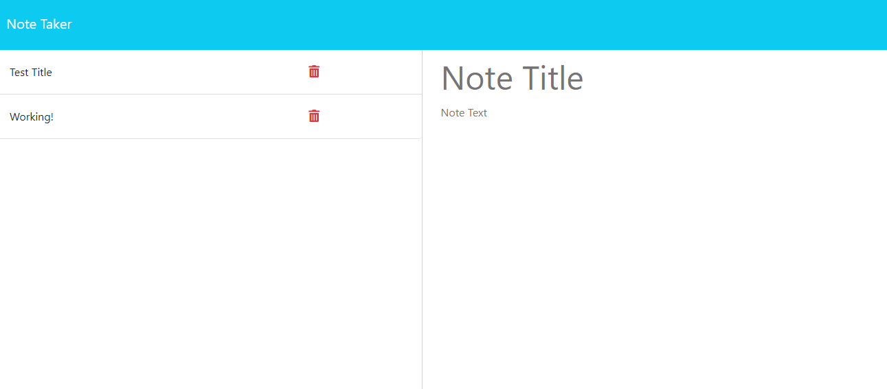

<h1>Note Taker</h1>

<h2>Description</h2>
This project enables the user to create new notes and save them on the site.

https://note-takerr-d4646bb0b187.herokuapp.com/

<h2>Table Of Contents</h2>

<a href='#install'>Install</a>

<a href='#usage'>Usage</a>

<a href ='#license'>License</a>

<a href ='#contributions'>Contributions</a>

<a href ='#tests'>Tests</a>

<a href='#questions'>Questions</a>

<h2 id='install'>Installation</h2>
Once you clone the repo onto your computer, run npm install to install packages required to run this project.

<h2 id='usage'>Usage</h2>To run this project type node server.js into your integrated terminal and answer the prompted questions in the terminal. Than you will see the file created as logo.svg, you can right click that and open in live server to view your new logo!

<h2 id='license'>License</h2>MIT

<h2 id='contributions'>Contributions</h2>Research on W3 schools and stack overflow

<h2 id='tests'>Tests</h2>N/A

<h2 id='questions'>Questions</h2>

Find me on Github: @ayay2002

https://github.com/ayay2002

Email: ayaypsn@gmail.com

If you have any questions regarding this project please contact me at the above listed email and i will get back to you as soon as possible! Thank you.